# Hamad Naeem

**Full-stack engineer in the making** · BSCS @ UMT, Lahore

<samp>SHIPPED TO PROD</samp>

That crate is a full SaaS: live market data, custom charts, auth, subscriptions. Built with AI assistance while I learn every layer of it.

 Live at <a href="https://rsiscreener.me">rsiscreener.me</a>. Press the crate for the build.

